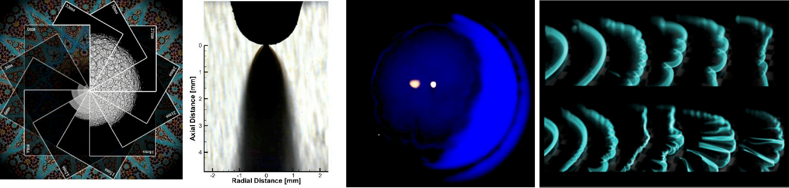

<strong>Cash prizes</strong> will be awarded for first place ($300) in both Artistic Merit and Technical Merit categories.

Submissions will be evaluated based on their artistic merit and/or technical merit,
and prizes will be awarded for both categories. Eligible entries include (but are not limited to):
- images (photographs or computer-generated),
- paintings,
- drawings,
- sketches,
- sculpture,
- videos, etc.

of combustion or combustion-related phenomena. Rearrangement, assembly, or modification of
combustion images into an art-form is appropriate and encouraged. Some examples of
such works are shown below. Submission indicates your permission for your artwork
to be displayed on the CSSCI website.

## Instructions

Electronically submit a high resolution image or video with **caption and brief explanation**
of your submission to <art@cssci.org> by **8 March 2019**. To participate, at least
one of the submitters is required to be a registered attendee at the meeting and
display the artwork at the meeting.

In case of an image, we recommend you mount it within a frame of size **no greater than 25" by 16"**.
The display should include the caption, brief explanation, and submitters' names and affiliation.
Please consider your travel plans when determining art size (luggage size, for example).
Similar to what one would see in an art gallery, the quality of printing, use of border,
frames, 3D effects, etc, can significantly enhance the visual and professional appeal of
your artwork. We recommend video submissions be displayed using an appropriate imaging device
set to repeat, with the title of the piece visible on the screen. Video displays should
NOT include a separate still image entry.

You are expected to set up your display at the meeting site by 8:00 AM on Monday,
March 25th and remove it by the end of the meeting. We will provide easels or tables
for your art displays. Contact [Sandra Olson](mailto:sandra.olson@nasa.gov)
if you have special display needs. We cannot provide security for your displays.

The peer voting will continue until the afternoon break on Tuesday, March 25th. We plan to announce
the winners at the banquet on Tuesday, March 25th. We thank you for your
contributions and look forward to a very successful event. We look forward to seeing
your combustion art work! Best of luck in the competition!

Visit <a href="https://cssci.org">https://cssci.org</a> to view past winners of
Combustion Art Competition.

{:class="img-fluid"}
