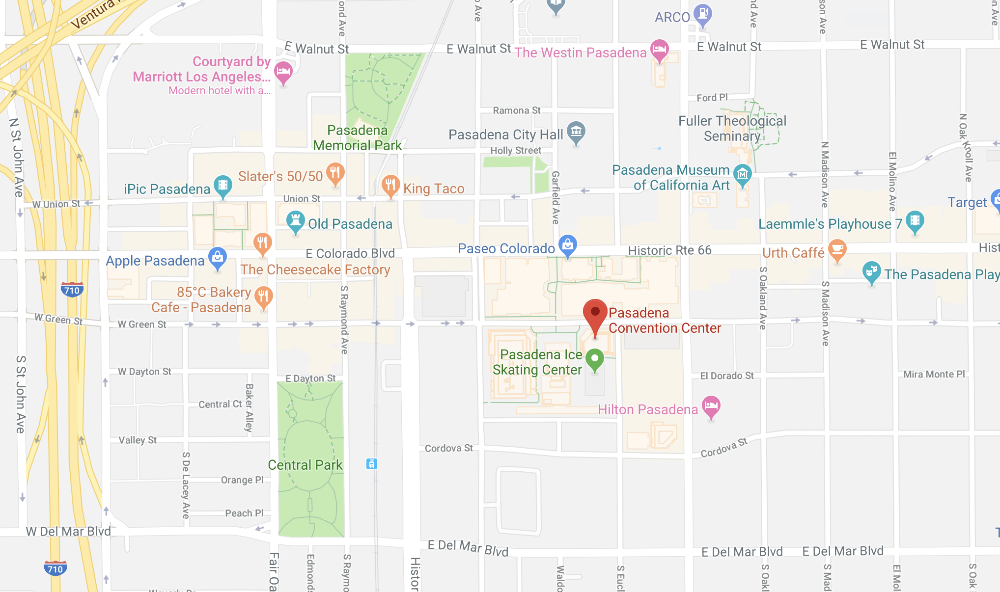

The US NCM 2019 will be held on March 24-27, 2019 in Pasadena CA.

#### Conference Location

<i class="fa fa-map-marker mr-3" aria-hidden="true"></i>
[Pasadena Convention Center, 300 E Green St, Pasadena, CA 91101](https://goo.gl/maps/gBEU4DWjhc72)

#### Accommodations

Accommodations for meeting participants are available at the following hotels.
When making your reservation by phone, refer to the "US National Combustion Conference".
Each of these hotels offers on-site parking for a fee ($14–19 per day).

##### Sheraton Pasadena Hotel - A few yards away
<i class="fa fa-map-marker mr-3" aria-hidden="true"></i>[303 Cordova St, Pasadena, CA 91101](https://goo.gl/maps/C9HXoKRnysp) 
Phone: (626) 449-4000, Fax: (626) 796-6209 
Rate: $219/night plus applicable taxes; rate includes complimentary wireless internet. 
Link: <https://www.starwoodmeeting.com/Book/USNCM11> 
Cut-off date: February 24, 2019.

##### Hilton Pasadena Hotel - 0.2 mi, 5 min walk
<i class="fa fa-map-marker mr-3" aria-hidden="true"></i>[168 South Los Robles Ave, Pasadena, CA 91101](https://goo.gl/maps/E3wMFJUxwSm) 
Phone: (626) 577-1000, Fax: (626) 584-3132 
Rate: $189/night plus applicable taxes; rate includes complimentary wireless internet. 
Link: <http://www.hilton.com/en/hi/groups/personalized/P/PASPHHF-USNCM-20190322> 
Cut-off date: February 20, 2019.

##### Westin Pasadena Hotel - 0.4 mi, 8 min walk
<i class="fa fa-map-marker mr-3" aria-hidden="true"></i>[191 North Los Robles Ave, Pasadena, CA 91101](https://goo.gl/maps/tjxnD7siaJG2) 
Phone: (626) 792-2727, Fax: (626) 795-7669 
Rate: $189/night plus applicable taxes; rate includes complimentary wireless internet. 
Cut-off date: March 4, 2019.

#### Travel

The Pasadena Convention Center is served by several airports

- Burbank Airport (BUR) is 16 miles away
- Los Angeles Airport (LAX) is 28 miles away
- Long Beach Airport (LGB) is 33 miles away
- Ontario Airport (ONT) is 38 miles away
- John Wayne Airport (SNA) is 48 miles way

Detailed information about Parking and Directions may be found on the convention center website: <https://pasadenacenter.visitpasadena.com/directions-parking/>

For information about public transportation to the convention center, please follow the link: <https://pasadenacenter.visitpasadena.com/public-transportation/>

#### Directions to venue

