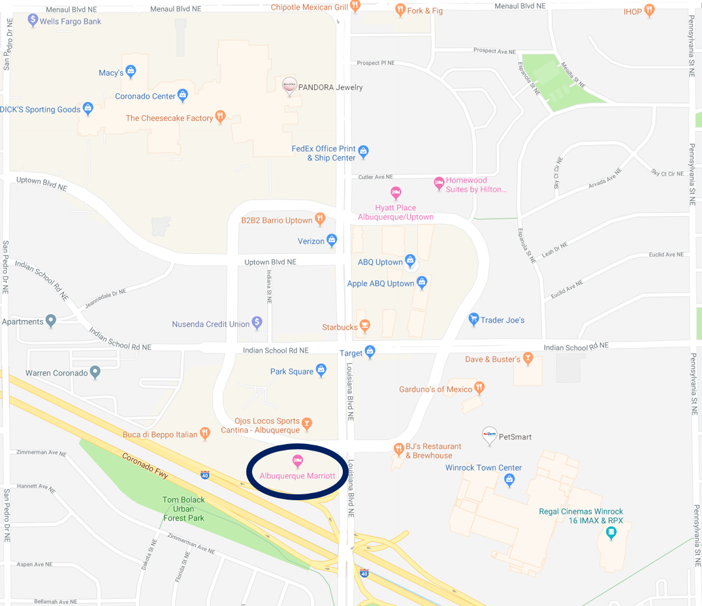

The WSSCI Fall Technical Meeting will be held on October 14-15, 2019 in Albuquerque, NM.

#### Conference Location

<!--
<i class="fa fa-map-marker mr-3" aria-hidden="true"></i>
[Pasadena Convention Center, 300 E Green St, Pasadena, CA 91101](https://goo.gl/maps/gBEU4DWjhc72)-->
TBA

#### Accommodations

Accommodations for meeting participants are available at the following hotel.

##### Albuquerque Marriott Hotel
<i class="fa fa-map-marker mr-3" aria-hidden="true"></i>[2100 Louisiana Boulevard NE Albuquerque, NM](https://goo.gl/maps/tkCnj4DMTaL2) 
Phone: (505) 881-6800 
Rate: $94/night plus applicable taxes. 
Link: <https://www.marriott.com/hotels/travel/abqnm-albuquerque-marriott/> 

#### Travel

Albuquerque is served by the Albuquerque International Sunport (ABQ).

#### Directions to venue

<!---->
TBA
